# Diving Magpie Software 
A huge collection of _SolidWorks_ addins, written in _Borland C++ Builder_ and _Visual Studio C++_

## Background

  
SolidWorks addins

These were written c1996-c2000 and probably do not show the best practices for C++ as I was just
learning C++/COM and fumbling my way through.  However, in my defence,  "Shipping code trumps everything"!

The first addins were developed as out-of-process exe's using _Borland C++ Builder_. The main advantage was
almost _Visual Basic_ like rapid development of user interfaces.

Later addins were done as in-process dll's with _Microsoft Visual C++_.  It was a huge culture shock to
develop user interfaces in _MFC_ after being spoilt with _Borland C++ Builder_'s _VCL_!

## Addins

### Activault Control Panel 

Windows control panel for _Activault_ version control system for _SolidWorks_

### BMPWorks

BMPWorks allows you to directly copy the SolidWorks bitmap preview to the Windows clipboard.  SolidWorks is not required.

BMPWorks adds a context sensitive menu to the right mouse button of Windows Explorer

  
Screenshots

  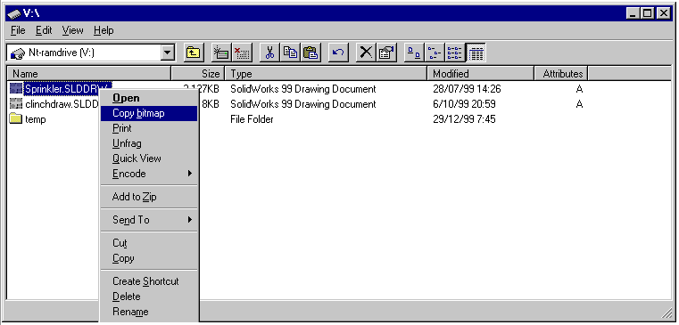

### BundleWorks

BundleWorks allows you to save files as WinZip compatible files for archiving or sending by email or FTP.  BundleWorks will also allow you to transparently unzip and open WinZip files.

BundleWorks adds option to:
* SolidWorks Save As dialog box
* SolidWorks Open dialog box

### ColourWorks 

Assign random colours to all parts in an assembly so that no two components have the same colour

### DiffWorks 

Find the differences between two parts and display the differences in a new part.

### GhostWorks 

Control visibility of components in an assembly

### JPGWorks 

Save current view as a jpg file

### LoupeWorks 

Magnify what is under cursor in current _SolidWorks_ window

### MenuWorks 

Add your own menu items to _SolidWorks_ to start external programs

  
Screenshots

  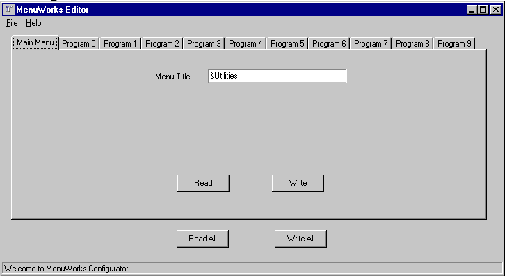

  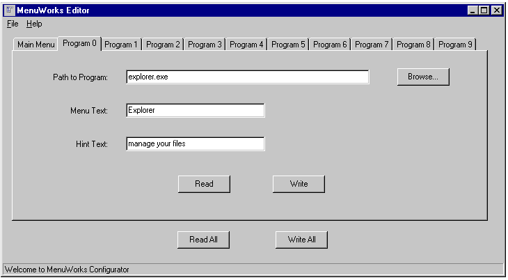

### OrbWorks 

Use a cheap, [games controller](https://en.wikipedia.org/wiki/SpaceOrb_360) instead of a
[SpaceBall](https://www.3dconnexion.com/) to manipulate the view

It is still possible to
[use one](https://www.hanselman.com/blog/TheBestControllerForFPSASpaceTecSpaceOrb360ControllerWorkingWithWindows7UsingArduinoAndOrbShield.aspx),
even after all these years!

  
Screenshots

  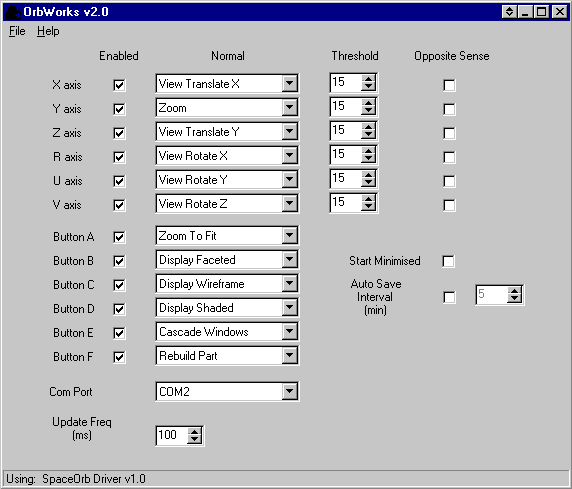
  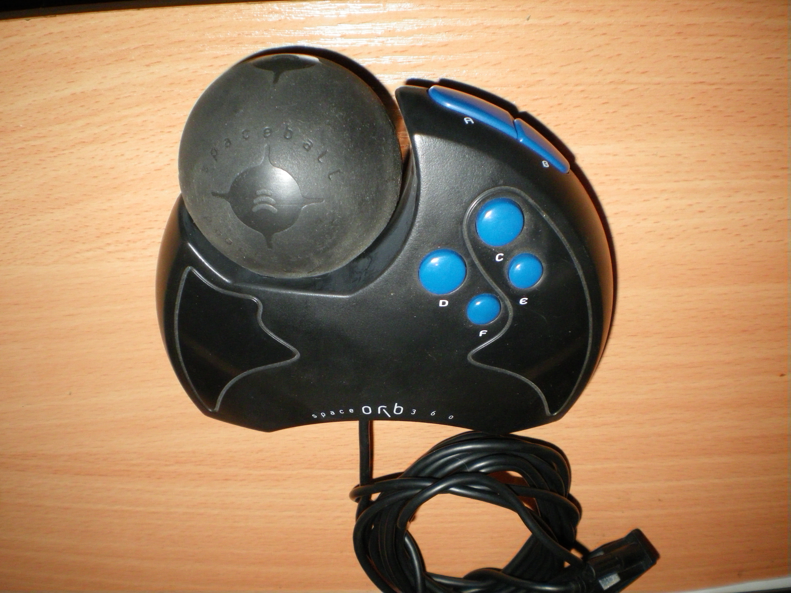
  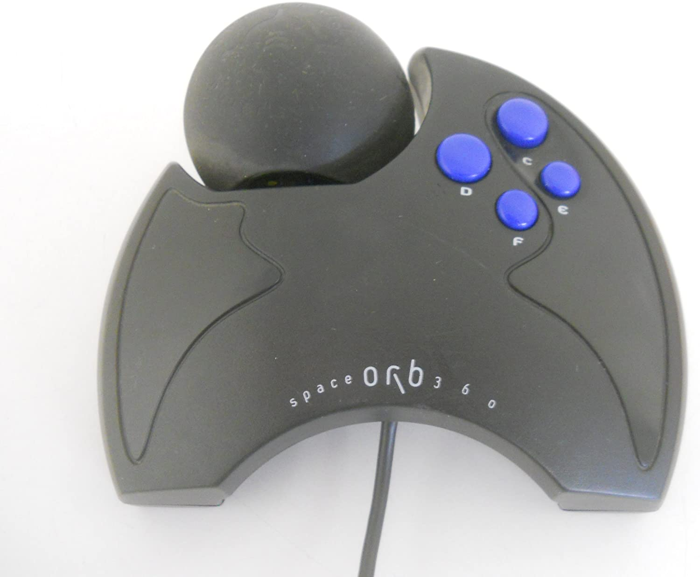

### PDFWorks

Save as PDF for _SolidWorks_

### PictureWorks

PictureWorks™ is an addin for the solids modeling software SolidWorks®. It allows you to copy the current bitmap image to the clipboard.  You can then paste directly into any software which supports a bitmap format.

PictureWorks™ eliminates the intermediate step of having to save the current file as a TIFF file.

PictureWorks™ works with parts, assemblies and drawings.

### PltWorks 

Batch plotting for _SolidWorks_

  
Screenshots

  

  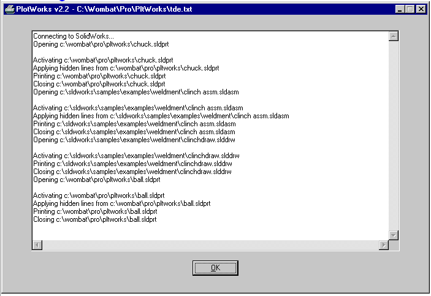

### PNGWorks 

Save current view as a png file

### PointerWorks 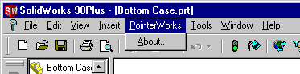

View manipulation on right mouse button and scrolling wheel

### PwrWorks 

Access hidden _SolidWorks_ settings

  
Screenshots

  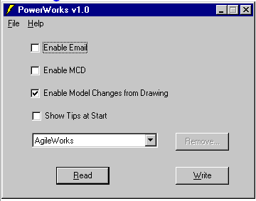

### ScaleWorks 

Scale a _SolidWorks_ part with options for sketches

  
Screenshots

  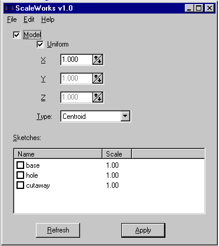

### ScreenWorks 

Screen saver showing _SolidWorks_ parts and assemblies based on
[Spinfire](https://www.actify.com/cad-viewer/) CAD viewer from [Actify](https://www.actify.com/)

### SpellWorks 

Spell checker for _SolidWorks_ drawings

  
Screenshots

  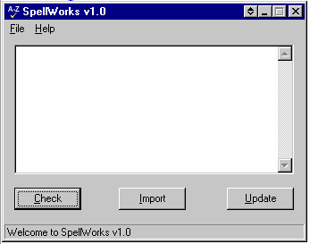

  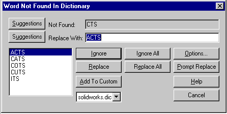

### StickInfo

Diagnostics utility to get information about connected joystick

### StickWorks 

Use a cheap, [joystick](https://en.wikipedia.org/wiki/Microsoft_SideWinder#3D_Pro) instead of a
[SpaceBall](https://www.3dconnexion.com/) to manipulate the view

  
Screenshots

  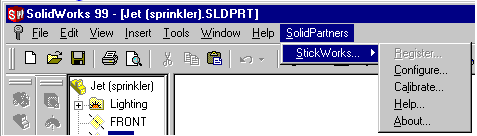

  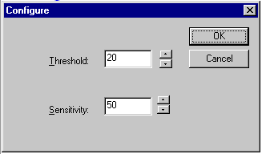

  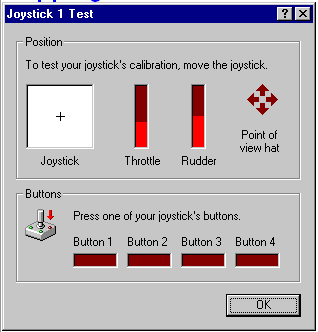

  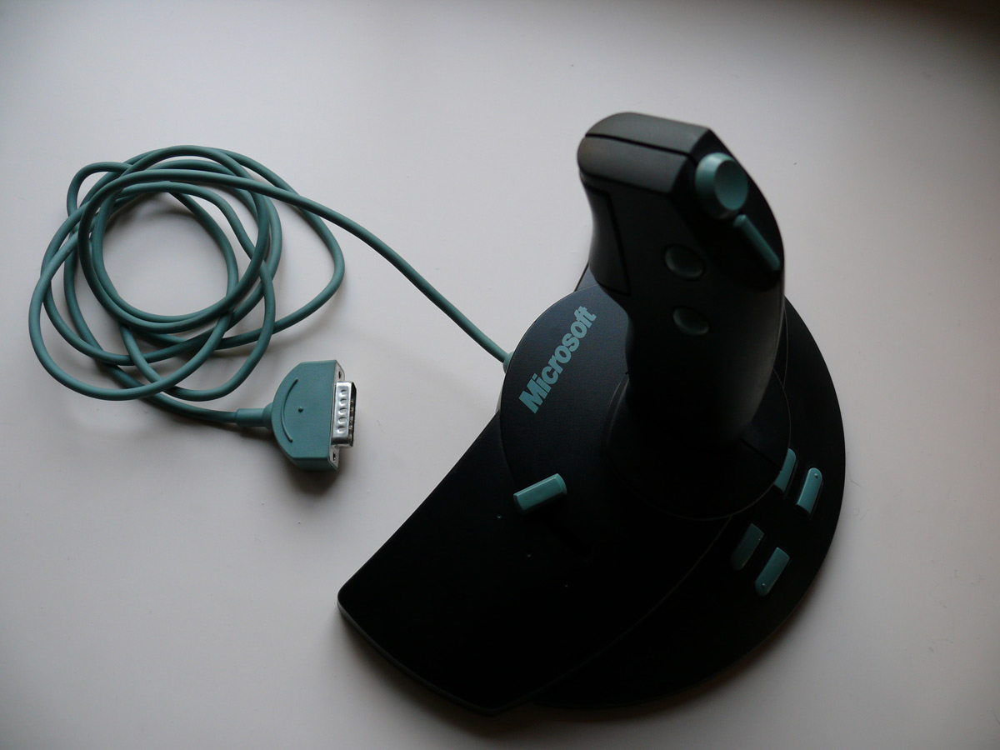

### StkWorks 

Use a cheap, [joystick](https://en.wikipedia.org/wiki/Microsoft_SideWinder#3D_Pro) instead of a
[SpaceBall](https://www.3dconnexion.com/) to manipulate the view

### STLWorks 

Import STL (stereolithography) files and attempt to create a solid model

### UnfragWorks 

Automatically reduce the size of _SolidWorks_ files by removing shadow copy of OLE structured
storage

### UnfragWorks Server 

Windows service to automatically reduce the size of _SolidWorks_ files by removing shadow copy of OLE structured storage.

UnfragWorks Server is a utility to remove the redundant space from SolidWorks files.  UnfragWorks Server can reduce the size of SolidWorks files by up to 50% with absolutely no loss of data or information.  UnfragWorks Server will constantly save you hard disk space by continually removing redundant space from SolidWorks files.

When first started, UnfragWorks Server will scan all the specified directories and subdirectories for SolidWorks files.  These are added to an initial list of files for unfragging.  During it's first unfragging run, UnfragWorks Server will attempt to unfrag all of these files.  These are then marked as unfragged and no further attempts will be made to unfrag them unless they change.

UnfragWorks Server then keeps watches over user specified directories and subdirectories for changes in SolidWorks files.  When UnfragWorks Server detects a changed file, it notes this and will unfragment all changed files at a user specified time.

UnfragWorks Server installs as an NT service and runs transparently in the background.  An icon with a right mouse button menu (figure below) is installed in the system tray.

  
Screenshots

  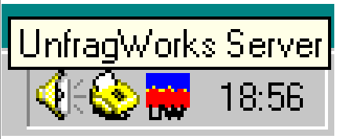

  

  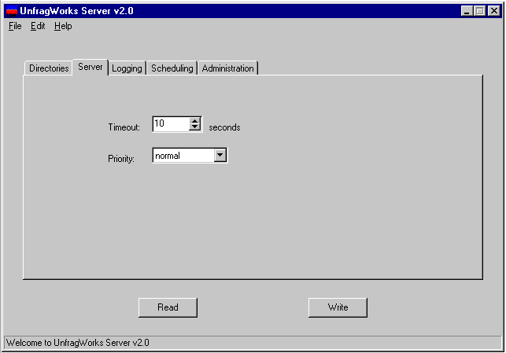

  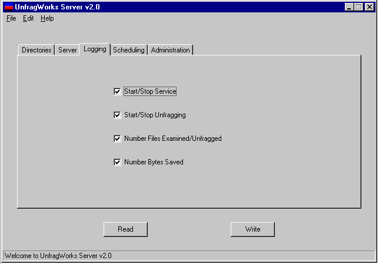

  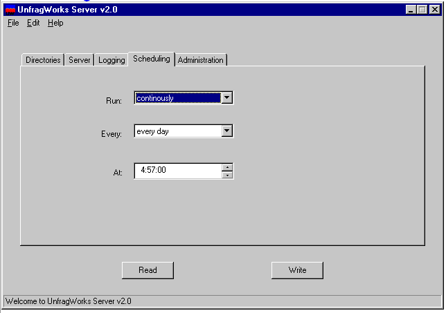

  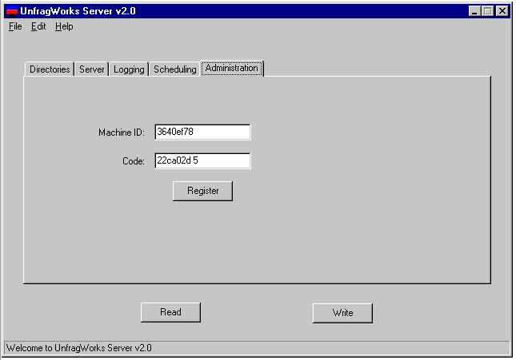

### UnstoreWorks 

Remove _Parasolid_ body information from _SolidWorks_ files

### ViewWorks 

Convert files to view-only format

  
Screenshots

  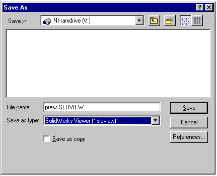

  

  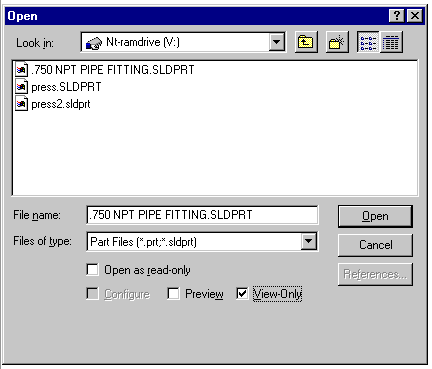

  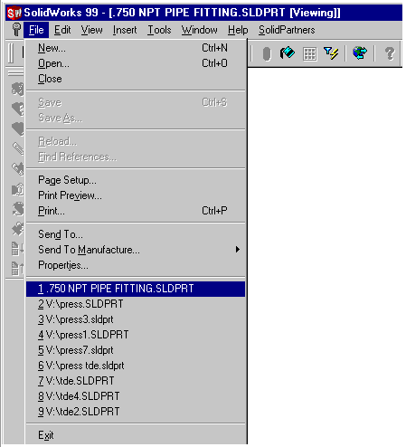

  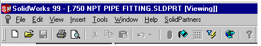

### VRMLWorks 

Import VRML (virtual reality markup language) files and attempt to create a solid model

### WinWks

Advanced window management for _SolidWorks_

### XGLWorks 

Import XGL (Reality Wave) files and attempt to create a solid model

### ZipWorks 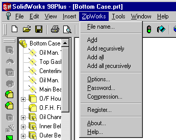

Compress current file into a PkZip archive

### CodeGen

Reseller utility to generate product authorisation codes for various products based on hard disk serial number

### MachID

Get unique identifier based on hard disk serial number

### Support Code

### Common

Holding place for generally useful-ish C++ code

### DMS_Common

Common UI functionality

### DMS_CustProps

Manipulate OLE file custom properties

### DMS_DiffWks

Configuration UI for _DiffWorks_

### DMS_JPGWks

Configuration UI for _JPGWorks_

### DMS_PDFWorks

Configuration UI for _PDFWorks_

### DMS_ProgPipe

General progress bar

### DMS_PSWks

Configuration UI for _UnstoreWorks_

### DMS_StkWks

Configuration UI for _StkWorks_

### DMS_Unfg

Configuration UI for _UnfragWorks_

### DMS_Web

Web related functionality in a more platable form

### DMS_WinError

_Windows_ error codes in a more palatable form

### DMS_XML_XSL

_Microsoft_ XML+XSL related functionality in a more platable form

